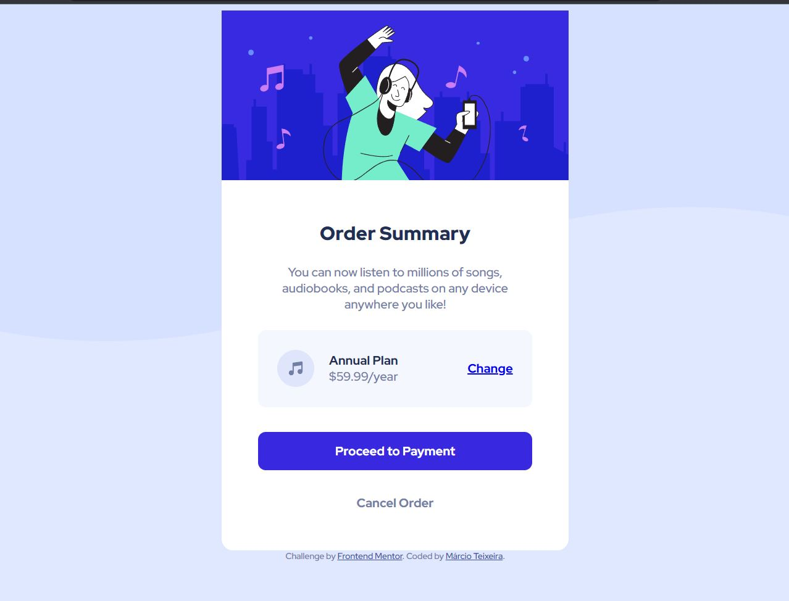

# Frontend Mentor - Order summary card solution - Version 1.0

This is a solution to the [Order summary card challenge on Frontend Mentor](https://www.frontendmentor.io/challenges/order-summary-component-QlPmajDUj).

## Table of contents

- [Overview](#overview)
  - [The challenge](#the-challenge)
  - [Screenshot](#screenshot)
  - [Links](#links)
- [My process](#my-process)
  - [Built with](#built-with)
  - [What I learned](#what-i-learned)
  - [Continued development](#continued-development)
  - [Useful resources](#useful-resources)
- [Author](#author)
- [Acknowledgments](#acknowledgments)

## Overview

### The challenge

Users should be able to:
- See hover states for interactive elements

### Screenshot

### Links

- Solution URL: [Add solution URL here](https://your-solution-url.com)
- Live Site URL: [Add live site URL here](https://your-live-site-url.com)

## My process

1. I started looking carefully the project design to figure out the basic HTML structure.
2. I coded the complete HTML code with my first observations.
3. I added the fonts and crated the .css file.
4. I coded the first variables I'd use from the style-guide.md: font-size, font-weights and colors
5. I added the background color and top figure.
6. I added the Title, Description, Payment/Cancel buttons
7. I added the top figure
8. I added the section with music icon, plan type, plan value and change button
9. I added the flexbox to organize the divs for each section.

### Built with

- Semantic HTML5 markup
- CSS custom properties
- Flexbox
- Mobile-first workflow

### What I learned

- CSS variables
- Flexbox
- Hover
- Background images

### Continued development

What's left to be done:
  - I need to fix the body container position.
  - I need to finish the mobile version.

What I want to improve:
  - flexbox
  - my skills with more complex layouts.

### Useful resources

- [CSS](https://www.w3schools.com/css/default.asp) - This helped me with many basic concepts in CSS.

## Author

- Frontend Mentor - [@marcioUfrj](https://www.frontendmentor.io/profile/marcioUfrj)
- Twitter - [@yourusername](https://www.twitter.com/yourusername)

## Acknowledgments

